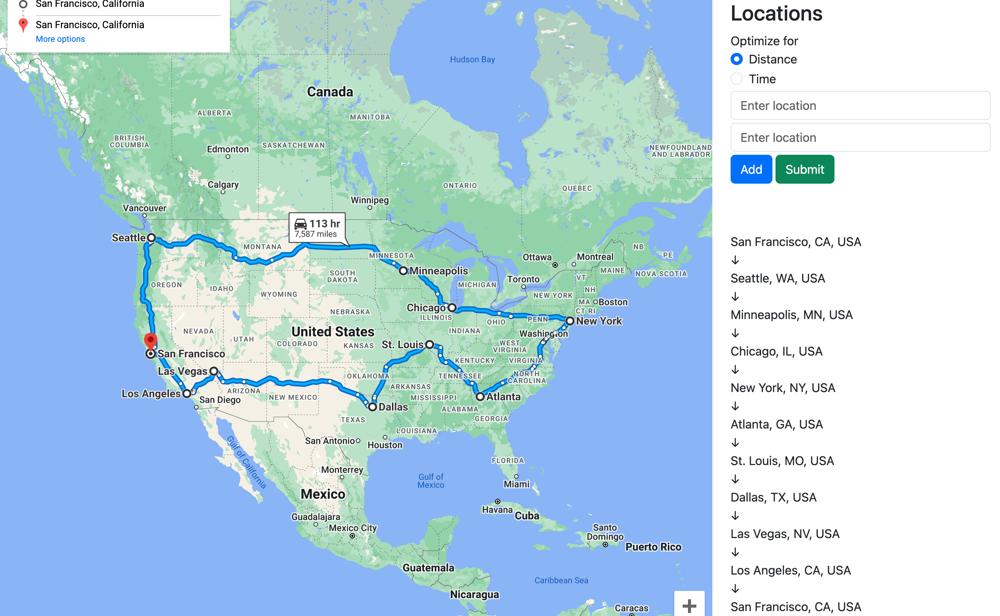

# order-my-trip



Google Maps is undoubtedly a valuable tool for navigation. Nevertheless, it
lacks a crucial feature – the ability to determine the most efficient order in
which to visit multiple destinations. While users can manually input waypoints,
this does not guarantee the shortest or quickest route between cities or
landmarks.

This is essentially the traveling salesperson problem. The task is to determine
the optimal sequence for visiting $n$ cities, ensuring that the
salesperson returns to the starting point while covering the shortest possible
total distance.

## Setup

Clone the repository to your machine.

Generate a Google Maps API key
[here](https://developers.google.com/maps/documentation/javascript/get-api-key).
Set it as an environment variable.

```bash
export GMAPS_API_KEY=<your-key-here>
```

Create a virtual environment and install all dependencies from
`requirements.txt`.

```bash
python3 -m venv .venv
source .venv/bin/activate
pip install -r requirements.txt
```

Run the application as

```bash
python ui.py
```

Open the web application at `localhost:5000`.
